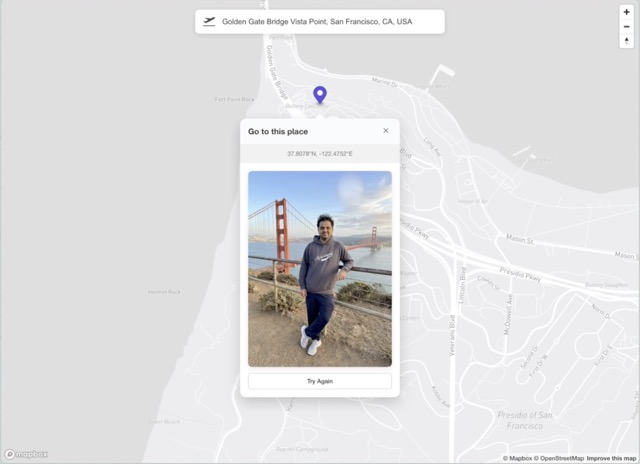

# GoPlaces 🌍✈️

An AI-powered web application that generates realistic, Instagram-worthy photos of you at any location in the world. Simply upload your photo, select a location on the map, and let AI place you there!



## 🎯 Use Case

Ever wanted to share photos from exotic locations without actually traveling? GoPlaces makes it possible by:
- Creating realistic composite images of you at any geographic location
- Generating travel content for social media, portfolios, or just for fun
- Visualizing what you'd look like at different tourist destinations
- Creating unique personalized images with proper geographical context

Perfect for:
- Social media content creators
- Travel enthusiasts
- Digital nomads showcasing their journey
- Anyone who wants to see themselves at famous landmarks

## ✨ Features

- **Interactive Map Interface**: Powered by Mapbox with Google Maps Places autocomplete
- **Location Search**: Search for any place in the world with auto-suggestions
- **Click-to-Select**: Click anywhere on the map to select a location
- **Photo Upload**: Upload your photo with persistent storage
- **AI Image Generation**: Uses fal.ai's nano-banana-pro/edit model to generate realistic composite images
- **Smooth Animations**: Beautiful transitions and loading states
- **Responsive Design**: Works seamlessly across devices
- **Location Persistence**: Your uploaded photo is saved locally for convenience

## 🛠️ Tech Stack

### Frontend (Client)
- **React 19** with TypeScript
- **Vite** - Fast build tool
- **Mapbox GL** - Interactive map rendering
- **Google Maps Places API** - Location search and autocomplete
- **Axios** - HTTP client
- **Lucide React** - Modern icon library
- **Lottie React** - Smooth animations

### Backend (Server)
- **Express.js** - Web framework
- **TypeScript** - Type safety
- **Multer** - File upload handling
- **fal.ai API** - AI image generation
- **CORS** - Cross-origin resource sharing
- **dotenv** - Environment variable management

## 📋 Prerequisites

Before you begin, ensure you have the following installed:
- **Node.js** (v18 or higher)
- **npm** (v9 or higher)

You'll also need API keys for:
- **Mapbox** - [Get API key](https://account.mapbox.com/access-tokens/)
- **Google Maps** (with Places API enabled) - [Get API key](https://developers.google.com/maps/documentation/javascript/get-api-key)
- **fal.ai** - [Get API key](https://fal.ai/)

## 🚀 Setup Instructions

### 1. Clone the Repository

```bash
git clone <repository-url>
cd goplaces
```

### 2. Install Dependencies

You can install all dependencies at once:

```bash
npm run install:all
```

Or install them separately:

```bash
# Install client dependencies
cd client
npm install

# Install server dependencies
cd ../server
npm install
```

### 3. Configure Environment Variables

#### Client Configuration

Create a `.env` file in the `client/` directory:

```env
VITE_MAPBOX_TOKEN=your_mapbox_access_token_here
VITE_GOOGLE_MAPS_API_KEY=your_google_maps_api_key_here
VITE_API_URL=http://localhost:3001/api/generate
```

#### Server Configuration

Create a `.env` file in the `server/` directory:

```env
PORT=3001
FAL_KEY=your_fal_ai_api_key_here
```

### 4. Run the Application

#### Option 1: Run Both Client and Server Together (Recommended)

From the root directory:

```bash
npm run dev
```

This will start:
- Server on `http://localhost:3001`
- Client on `http://localhost:5173`

#### Option 2: Run Client and Server Separately

**Terminal 1 - Start the Server:**
```bash
cd server
npm run dev
```

**Terminal 2 - Start the Client:**
```bash
cd client
npm run dev
```

### 5. Access the Application

Open your browser and navigate to: `http://localhost:5173`

## 📁 Project Structure

```
goplaces/
├── client/                    # React frontend application
│   ├── public/               # Static assets
│   │   ├── flight.png       # Flight icon
│   │   └── vite.svg         # Vite logo
│   ├── src/
│   │   ├── assets/          # Images and animations
│   │   │   ├── flight-turbulence.json
│   │   │   ├── flight.png
│   │   │   └── react.svg
│   │   ├── App.tsx          # Main application component
│   │   ├── App.css          # Application styles
│   │   ├── main.tsx         # Application entry point
│   │   ├── index.css        # Global styles
│   │   └── google-maps.d.ts # TypeScript declarations for Google Maps
│   ├── package.json         # Client dependencies
│   └── vite.config.ts       # Vite configuration
│
├── server/                   # Express backend API
│   ├── src/
│   │   └── index.ts         # Server entry point and API routes
│   ├── uploads/             # Temporary file storage (auto-generated)
│   ├── package.json         # Server dependencies
│   └── tsconfig.json        # TypeScript configuration
│
├── package.json             # Root scripts
└── README.md               # This file
```

## 🔌 API Documentation

### POST `/api/generate`

Generates an AI-powered composite image of a person at a specific location.

**Request:**
- Method: `POST`
- Content-Type: `multipart/form-data`

**Parameters:**
- `lat` (string): Latitude of the location
- `lng` (string): Longitude of the location
- `image` (file): User's photo (JPEG, PNG, etc.)

**Response:**
```json
{
  "success": true,
  "imageUrl": "https://...",
  "message": "Image generated successfully with fal.ai",
  "requestId": "..."
}
```

**Error Response:**
```json
{
  "error": "Error message description"
}
```

## 🎨 How It Works

1. **Search or Click**: Use the search bar to find a location, or click anywhere on the map
2. **Upload Photo**: Click the upload area to select your photo (saved automatically)
3. **Generate**: Click "Go to this place" button
4. **AI Processing**: 
   - Your photo is uploaded to fal.ai storage
   - Location coordinates are converted to DMS (Degrees, Minutes, Seconds) format
   - AI model extracts the person from your photo (ignoring background)
   - Generates a realistic composite image at the selected location
5. **View Result**: Your generated image appears in the popup
6. **Try Again**: Generate multiple variations by clicking "Try Again"

## 🔑 Environment Variables Reference

### Client (.env)
| Variable | Description | Example |
|----------|-------------|---------|
| `VITE_MAPBOX_TOKEN` | Mapbox API access token | `pk.eyJ1...` |
| `VITE_GOOGLE_MAPS_API_KEY` | Google Maps API key | `AIzaSy...` |
| `VITE_API_URL` | Backend API endpoint | `http://localhost:3001/api/generate` |

### Server (.env)
| Variable | Description | Example |
|----------|-------------|---------|
| `PORT` | Server port number | `3001` |
| `FAL_KEY` | fal.ai API key | `fal_key_...` |

## 🐛 Troubleshooting

### Map not loading
- Verify your `VITE_MAPBOX_TOKEN` is valid
- Check browser console for errors
- Ensure you have internet connectivity

### Search autocomplete not working
- Verify your `VITE_GOOGLE_MAPS_API_KEY` is valid
- Ensure Places API is enabled in Google Cloud Console
- Check browser console for Google Maps API errors

### Image generation failing
- Verify your `FAL_KEY` is valid and has credits
- Check server logs for detailed error messages
- Ensure the uploaded image is in a supported format
- Check that the server is running on the correct port

### Server not starting
- Ensure port 3001 is not already in use
- Verify all server dependencies are installed
- Check that `.env` file exists in the server directory

## 📝 Development

### Build for Production

**Client:**
```bash
cd client
npm run build
```

**Server:**
The server runs with TypeScript directly using `tsx`. For production, you may want to compile TypeScript:
```bash
cd server
npx tsc
```

### Linting

```bash
cd client
npm run lint
```

## 🤝 Contributing

Contributions are welcome! Please feel free to submit a Pull Request.

## 📄 License

This project is licensed under the ISC License.

## 🙏 Acknowledgments

- [Mapbox](https://www.mapbox.com/) for the beautiful map interface
- [Google Maps Platform](https://developers.google.com/maps) for location search
- [fal.ai](https://fal.ai/) for AI image generation capabilities
- [Lucide](https://lucide.dev/) for the icon set

## 📧 Support

For issues, questions, or suggestions, please open an issue in the repository.

---

**Made with ❤️ for travel dreamers everywhere**

